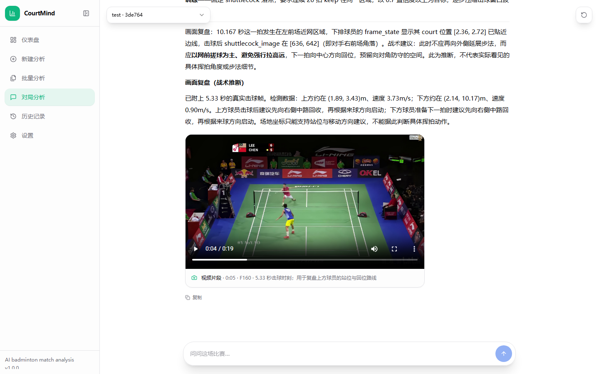

# CourtMind

> An intelligent badminton match video analysis platform covering court calibration, player pose estimation, shuttlecock tracking, automatic rally segmentation, hit counting, match reports, and data-grounded AI conversations.

[简体中文](README.md) | **English**



## Overview

CourtMind is a React and FastAPI application that turns badminton match videos into understandable performance data. After a video is uploaded, the system detects the court, tracks both players and the shuttlecock, estimates movement and rally events, and produces an annotated video, a structured match report, and actionable training suggestions.

The AI match-analysis workspace streams answers from Agnes or DeepSeek. Answers are grounded in the selected match's structured output. When a question benefits from visual review, the assistant can embed a frame or playable video clip from the relevant moment directly inside the conversation.

## Features

- Automatic four-corner court detection with CourtKeyNet and manual correction.
- TrackNetV4 Type B, TrackNetV3, and YOLO11 shuttlecock detectors.
- Three-model temporal ensemble with multi-candidate association, confidence weighting, motion consistency, and ambiguity rejection.
- Player detection, tracking, pose estimation, and skeleton rendering.
- Shuttlecock trajectories, player paths, and a top-down court visualization.
- Automatic rally segmentation, reliable hit counting, movement distance, and pace analysis.
- Single-video analysis and sequential batch processing for up to 50 videos.
- User-oriented match reports and targeted training recommendations.
- Agnes and DeepSeek chat with SSE streaming and inline video evidence.
- Analysis history, light/dark themes, and model/LLM settings.

> Hits, rallies, positions, and movement metrics are computer-vision estimates. They are not official scoring or referee decisions. Occlusion, video quality, camera angle, and low detection coverage may affect the results, and uncertainty is surfaced in the report.

## Technology Stack

| Layer | Technology |
| --- | --- |
| Frontend | React 18, TypeScript, Vite, Tailwind CSS, Radix UI |
| Backend | Python 3.10, FastAPI, Uvicorn |
| Vision runtime | PyTorch, Keras 3, Ultralytics, ONNX Runtime, RTMLib, OpenCV |
| Main models | CourtKeyNet, TrackNetV4, TrackNetV3, YOLO11, RTMPose / RTMO |
| LLM providers | Agnes and DeepSeek through OpenAI-compatible Chat Completions APIs |

## Requirements

- Windows 10 or Windows 11
- [Miniconda or Anaconda](https://docs.conda.io/projects/conda/en/latest/user-guide/install/windows.html)
- Node.js 18 or newer
- Python 3.10 in a conda environment named `badminton`
- An NVIDIA GPU is optional but strongly recommended for long videos

The currently verified Python version is `3.10.21`. The application uses these default addresses:

- Web application: <http://127.0.0.1:5173>
- Backend API: <http://127.0.0.1:8000>
- Interactive API documentation: <http://127.0.0.1:8000/docs>

## Model Weights

Download model weights only from the official project or release pages below. PyTorch `.pt` checkpoints may contain pickle data, so never load files from an untrusted source.

| Model | Download website |
| --- | --- |
| CourtKeyNet | [CourtKeyNet on Hugging Face](https://huggingface.co/Cracked-ANJ/CourtKeyNet) |
| YOLO11 shuttlecock detector | [Good-Badminton v0.1.0 Release](https://github.com/yo-WASSUP/Good-Badminton/releases/tag/v0.1.0) |
| YOLO11 pose | [Ultralytics Assets](https://github.com/ultralytics/assets/releases) |
| RTMPose / RTMO | [Good-Badminton Release](https://github.com/yo-WASSUP/Good-Badminton/releases/tag/v0.1.0) / [RTMLib model zoo](https://github.com/Tau-J/rtmlib) |
| TrackNetV3 / InpaintNet | [Official TrackNetV3 checkpoints on Google Drive](https://drive.google.com/file/d/1CfzE87a0f6LhBp0kniSl1-89zaLCZ8cA/view?usp=sharing) |
| TrackNetV4 Type B | [Official TrackNetV4 results and weights page](https://github.com/TrackNetV4/TrackNetV4/blob/main/docs/RESULT.md) |

After downloading the required files, open Settings in CourtMind to verify that each model is ready.

## Installation

The following commands are intended for Windows Command Prompt and use paths relative to the current directory.

### 1. Create the conda environment

```bat
conda create -n badminton python=3.10 -y
conda activate badminton
```

### 2. Install backend dependencies

```bat
cd CourtMind
python -m pip install -r requirements.txt
```

`requirements.txt` references the CUDA 12.4 PyTorch wheel index. If your driver or CUDA setup differs, select a compatible build on the [official PyTorch installation page](https://pytorch.org/get-started/locally/) before installing the remaining dependencies.

### 3. Install frontend dependencies

```bat
cd frontend
npm install
cd ..
```

### 4. Configure an LLM provider (optional)

```bat
copy .env.example .env
```

Edit `.env` and provide your own key for one or both services:

```env
AGNES_API_KEY=your-agnes-api-key
AGNES_MODEL=agnes-2.5-flash
AGNES_CHAT_URL=https://apihub.agnes-ai.com/v1/chat/completions

DEEPSEEK_API_KEY=your-deepseek-api-key
DEEPSEEK_MODEL=deepseek-v4-flash
DEEPSEEK_CHAT_URL=https://api.deepseek.com/chat/completions
```

`.env` is ignored by Git. Never place a real secret in `.env.example`, a README, frontend source code, or commit history.

## Start and Stop

### Recommended: Windows Command Prompt

Run this directly from the project root:

```bat
start.bat
```

The script starts FastAPI and Vite in the background and waits for both health checks. Open <http://127.0.0.1:5173> after startup completes.

Stop both services with:

```bat
stop.bat
```

> Do not run `bash start.bat` or `bash stop.bat`. A `.bat` file is a Windows Command Prompt script; launching it through Bash causes errors such as `@echo: command not found` or `Exec format error`.

### PowerShell

```powershell
.\start.ps1
.\stop.ps1
```

`start.sh` is only a bridge for Git Bash or WSL. Prefer `start.bat` in Command Prompt. Startup logs are written to `logs/`.

### Manual startup for troubleshooting

Backend terminal:

```bat
conda activate badminton
python -m uvicorn backend.main:app --host 127.0.0.1 --port 8000 --reload
```

Frontend terminal:

```bat
cd frontend
npm run dev
```

## Workflow

1. Open New Analysis, upload a singles match video, and give the analysis a descriptive name.
2. Let CourtKeyNet detect the court. Drag the corner points if manual correction is needed.
3. Select the pose model, shuttlecock model, and AI provider in Settings.
4. Start the analysis and wait for the job to finish.
5. Play the annotated video in the result page while the side metrics update in sync with the timeline.
6. Open Match Analysis, select a completed match, and ask questions about movement, rallies, tactics, or training.

For multiple videos, use Batch Analysis. Jobs run sequentially so multiple TrackNetV4, TrackNetV3, and YOLO11 ensembles are not loaded at the same time. A failed video is recorded without stopping the rest of the queue.

## Shuttlecock Tracking Modes

| Mode | Description |
| --- | --- |
| `ensemble` | Temporal fusion of TrackNetV4, TrackNetV3, and YOLO11; highest compute cost and intended for accuracy-focused analysis |
| `tracknet_v4` | TrackNetV4 Type B with motion-aware fusion |
| `tracknet` | TrackNetV3 tracker followed by InpaintNet trajectory rectification |
| `yolo` | Faster single-frame YOLO11 detector retained as a compatibility option |

The ensemble does not simply average coordinates. It retains multiple candidates from each detector and associates them using observation confidence, model reliability, predicted uncertainty, and speed/direction consistency. A candidate is confirmed only after receiving temporal support; conflicting observations are rejected when the system cannot distinguish them reliably. See [the temporal fusion notes](docs/temporal-fusion.md) for implementation details and limitations.

## Outputs

Each analysis is written to `outputs/<job_id>/` and may contain:

| File or directory | Description |
| --- | --- |
| `detect_<source-name>.mp4` | Annotated video with pose skeletons, player/shuttlecock trajectories, and the top-down court |
| `metadata.json` | Video, model, court, trajectory, and statistics metadata |
| `match_report.json` | Rallies, hits, movement load, key moments, confidence warnings, and training suggestions |
| `chat_history.json` | Conversation history for each LLM provider and match |
| `chat_media/` | Frames and short video clips referenced by AI answers |

Numeric panels are not burned into the side of the output video. The result page renders those values separately and synchronizes them with the video's current playback time.

## Project Structure

```text
CourtMind/
├─ backend/                       # FastAPI application
│  ├─ api/                        # Video, court, job, batch, and chat routes
│  ├─ core/                       # Configuration, environment, and paths
│  ├─ schemas/                    # Pydantic request/response models
│  ├─ services/                   # Pipeline, jobs, LLM, media, and timeline services
│  └─ main.py                     # API entry point, CORS, and static mounts
├─ badminton_analysis/            # Project-local vision and analysis package
│  ├─ analysis/                   # Statistics and analysis logic
│  ├─ court/                      # Court detection and coordinate mapping
│  ├─ detection/                  # Pose and base detectors
│  ├─ events/                     # Rally and hit-event analysis
│  ├─ models/                     # Local TrackNetV3/V4 and YOLO11 implementations
│  ├─ shuttlecock/                # Detector adapters and temporal ensemble
│  ├─ tracking/                   # Player tracking
│  └─ visualization/              # Skeleton, trajectory, and top-down rendering
├─ frontend/                      # React 18 + TypeScript + Vite
│  └─ src/
│     ├─ components/              # Layout, analysis workflow, and reusable UI
│     ├─ hooks/                   # Analysis, polling, court, and status hooks
│     ├─ lib/                     # API client, chat streaming, coordinates, utilities
│     ├─ pages/                   # Dashboard, analysis, results, chat, history, settings
│     ├─ router/                  # Client-side routes
│     └─ types/                   # TypeScript types
├─ docs/                          # Design notes and README images
├─ weights/                       # Local model weights; excluded from Git
├─ templates/                     # Court template images
├─ videos/                        # Demonstration videos
├─ uploads/                       # User uploads; excluded from Git
├─ outputs/                       # Generated analysis jobs; excluded from Git
├─ logs/                          # Runtime logs; excluded from Git
├─ tests/                         # Automated tests
├─ requirements.txt              # Python dependencies
├─ start.bat / start.ps1 / start.sh
└─ stop.bat / stop.ps1
```

TrackNetV3, TrackNetV4, and YOLO11 model code used by CourtMind lives under `badminton_analysis/models/`. Independent upstream model repositories remain separate and are not removed or overwritten by this project.

## Troubleshooting

### Port 8000 is already in use

From the project root, run:

```bat
stop.bat
start.bat
```

If the error remains, inspect the latest `logs/backend-*.error.log` and use `netstat -ano | findstr :8000` to identify the process using the port.

### Frontend startup timed out

Inspect the latest `logs/frontend-*.error.log`. The most common causes are missing frontend dependencies or another process already using port 5173. Run `npm install` inside `frontend/` before retrying.

### The three-model ensemble runs out of memory

Batch jobs are sequential, but high-resolution videos can still consume significant RAM and VRAM. Close other GPU workloads, reduce the input resolution, or select TrackNetV4 or TrackNetV3 individually in Settings.

### AI chat is unavailable

Confirm that `.env` contains at least one valid API key, restart the backend, and select the corresponding provider in Settings. AI answers use the selected match's generated analysis data and do not treat detections as official scores or winners.

## Acknowledgements

CourtMind builds on excellent open-source projects, research implementations, and model ecosystems. Many thanks to their authors and maintainers:

- [Good-Badminton](https://github.com/yo-WASSUP/Good-Badminton) for the original badminton video-analysis project and model assets.
- [TrackNetV3](https://github.com/qaz812345/TrackNetV3) for shuttlecock trajectory prediction and InpaintNet rectification.
- [TrackNetV4](https://github.com/TrackNetV4/TrackNetV4) for motion attention and the Type A / Type B fusion framework.
- [BadmintonTrackNet](https://github.com/ZSHYC/BadmintonTrackNet) for TrackNetV3 engineering, inference, and event-analysis references.
- [Ultralytics](https://github.com/ultralytics/ultralytics) for the YOLO11 detection and pose ecosystem.
- [RTMLib](https://github.com/Tau-J/rtmlib) for lightweight RTMPose and RTMO inference.
- [MMPose](https://github.com/open-mmlab/mmpose) for OpenMMLab pose models and pretrained assets.
- [CourtKeyNet](https://huggingface.co/Cracked-ANJ/CourtKeyNet) for badminton court keypoint detection weights.
- [FastAPI](https://github.com/fastapi/fastapi), [React](https://github.com/facebook/react), and [Vite](https://github.com/vitejs/vite) for the web application foundation.

When using or redistributing third-party source code, model weights, datasets, or API services, follow the licenses and terms published by their respective owners.

## License

This repository's code is released under the [Apache License 2.0](LICENSE). Third-party source code, model weights, datasets, and API services retain their original licenses and terms.
